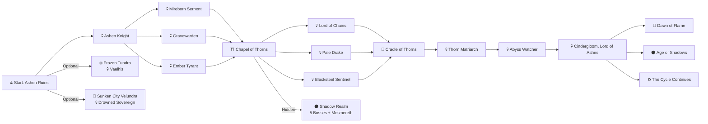

# ☠️ Elden Souls — A Dark Fantasy Text Adventure

[]()
[]()
[]()
[]()
[]()
[]()
[]()
[]()

[](https://github.com/TGOSS1984/text_adventure_game)
[](https://elden-souls-text-adventure-app-6406dec306fc.herokuapp.com/)

---

## 📸 Screenshots

### 🏠 Title / Character Select Screen


> *The atmospheric character select screen with class carousel and lore panels*

---

### 📖 Story Screen


> *The main story interface — typewriter narrative, branching choices and the looping bonfire video background*

---

### ⚔️ Battle Screen


> *The turn-based combat UI — HP/MP bars, active effects strip, dual special abilities and the battle timer*

---

### 💀 Death Screen


> *The death screen — atmospheric bonfire imagery and a prompt to begin again*

---

### 📐 Initial Wireframe


> *Early concept wireframe for the story/game screen layout*

---

## 📚 Table of Contents

- [The Inspiration](#-the-inspiration)
- [Project Purpose](#-project-purpose)
- [Features at a Glance](#-features-at-a-glance)
- [Tech Stack](#-tech-stack)
- [File Structure](#-file-structure)
- [How to Run Locally](#-how-to-run-locally)
- [Game Mechanics](#-game-mechanics)
  - [Character Classes](#character-classes)
  - [Starting Gifts](#starting-gifts)
  - [Combat System](#combat-system)
  - [Dual Specials System](#dual-specials-system)
  - [Active Effects](#active-effects)
  - [Souls & Shop](#souls--shop)
  - [Estus Flask Healing](#estus-flask-healing)
  - [Bonfire & Rest System](#bonfire--rest-system)
- [Enemies & Bosses](#-enemies--bosses)
- [Story & World](#-story--world)
  - [Story Architecture](#story-architecture)
  - [Branching Paths](#branching-paths)
  - [The Shadow Realm](#the-shadow-realm)
  - [Story Flowchart (Overview)](#story-flowchart-overview)
  - [Story Flowchart (Detailed)](#story-flowchart-detailed)
- [UI & Immersion](#-ui--immersion)
- [Audio System](#-audio-system)
- [Deployment](#-deployment)
- [Testing](#-testing)
- [Known Issues & Future Enhancements](#-known-issues--future-enhancements)
- [Credits](#-credits)

---

## 📖 The Inspiration

I have loved dark fantasy games — *Dark Souls*, *Elden Ring*, *Demon's Souls* — for a long time, but the root of this project goes further back. As a child, I was captivated by Ian Livingstone's *Fighting Fantasy* gamebooks: those *Choose Your Own Adventure* paperbacks where you played a lone hero navigating a monster-filled dungeon, making branching choices that led to wildly different outcomes, and rolling dice for turn-based combat that could end your run in an instant.

I wanted to build something in that spirit — a modern, web-based version of those gamebooks, where your choices genuinely matter, where the world feels dark and atmospheric, and where the combat has enough tactical depth to make each fight feel meaningful. *Elden Souls* is that project: a text adventure with 137 chapters of branching story, six distinct character classes each with unique stat builds and abilities, a full turn-based combat system with dodge, block, and dual special moves, boss fights with phase changes, a secret hidden realm, and a gothic visual style inspired by FromSoftware's art direction.

The game started as a pure Python console project and grew into a full Flask web application — a journey that taught me an enormous amount about OOP, session handling, HTMX, modular CSS, and what it actually takes to build something that feels *finished*.

---

## 🎯 Project Purpose

*Elden Souls* was built to demonstrate Python programming fundamentals in a genuinely engaging context: object-oriented design, session-based state management, modular code architecture, branching data structures, and web deployment via Flask and Heroku. The game is designed to engage players in exploration, decision-making, and tactical combat — mirroring the grim fantasy tone of *Elden Ring* and *Dark Souls* while carving out its own lore and world.

---

## ✨ Features at a Glance

- 6 unique playable classes, each with distinct stats, lore, and **dual special abilities**
- 137 story chapters across the main path, two optional branches, and a hidden Shadow Realm
- 171+ choice-to-chapter mappings in a flat JSON dictionary, hot-reloaded on every choice
- Turn-based combat: attack, dodge, block, Estus Flask, primary special, secondary special
- 13 regular enemies with distinct damage types (physical, magic, mixed)
- 18 bosses — 10 on the main path, 2 in optional story branches, 6 exclusive to the Shadow Realm
- Two-phase boss fights with mid-battle lore reveals and increased damage
- Active combat effects: damage-over-time (bleed/poison), attack buffs, damage shields, stun, life leech
- Soul rewards from every encounter, spent in an in-world shop on permanent upgrades
- Starting gift system — a unique item chosen at the start of each run
- Bonfire rest system — restore HP and Estus, with a rotating selection of atmospheric background images
- Secret Shadow Realm — a hidden optional route accessed via a glowing map icon appearing randomly on story chapters
- Victory overlay — animated gold banner on boss defeat before redirect
- Looping background video on desktop (static fallback on mobile)
- Responsive design: 5-file CSS split using custom properties, HTMX battle fragment, animated class select carousel
- Audio system: background music, combat sound effects, Estus flask audio, per-area tracks

---

## 🛠 Tech Stack

| Layer | Technology |
|---|---|
| Backend | Python 3.11 / Flask (session-based, no database) |
| Templates | Jinja2 |
| Partial updates | HTMX 1.9.12 |
| CSS | 5 split files using CSS custom properties |
| JavaScript | Vanilla JS — 11 standalone modules |
| Story data | JSON chapters (0–147) + flat `choices_mapping.json` |
| Deployment | Heroku (gunicorn) |
| Fonts | Mantinia (custom woff), Google Fonts (Cinzel) |
| Icons | Font Awesome |

---

## 📁 File Structure

```
elden_souls/
├── run.py
├── Procfile
├── requirements.txt
├── .python-version
├── .gitignore
│
└── app/
    ├── __init__.py
    ├── classes.py              ← Single source of truth for all class definitions
    ├── enemies.py              ← ENEMIES list + BOSSES dict (with phase2 lore)
    ├── combat.py               ← BattleManager class — full dual special + active effects
    ├── config.py               ← MP costs, cooldowns, backgrounds, REST_BGS, SHOP_ITEMS
    ├── models.py               ← Character / Enemy model classes
    ├── save_load.py            ← Session and JSON save/load logic
    │
    ├── routes/
    │   ├── __init__.py
    │   ├── game_routes.py      ← Story/game flow, secret map logic, shadow realm routes
    │   ├── battle_routes.py    ← Combat loop, specials, active effects, victory redirect
    │   └── shop_routes.py      ← Soul spending, upgrades
    │
    ├── story/
    │   ├── __init__.py
    │   ├── story_engine.py     ← choose_path() — loads mapping fresh from disk each call
    │   ├── story_loader.py
    │   ├── choices_mapping.json  ← 171+ entries: choice key → chapter ID
    │   └── chapters/           ← 0.json through 147.json (with some gaps)
    │
    ├── static/
    │   ├── css/
    │   │   ├── base.css        ← :root tokens, resets, typography
    │   │   ├── animations.css  ← keyframes, transitions, pulse effects
    │   │   ├── components.css  ← reusable UI components (buttons, cards, HUD)
    │   │   ├── battle.css      ← battle-screen layout and effect pills
    │   │   └── pages.css       ← page-specific overrides (index, shop, status, etc.)
    │   │
    │   ├── js/
    │   │   ├── audio_manager.js    ← Central audio routing and volume control
    │   │   ├── battle_sounds.js    ← Combat SFX triggers
    │   │   ├── battle_timer.js     ← Turn timer countdown UI
    │   │   ├── carousel.js         ← Class select carousel (3/2/1 cards per breakpoint)
    │   │   ├── char_select_music.js← Music autoplay on class select screen
    │   │   ├── ember_particles.js  ← Particle effect on bonfire/rest screens
    │   │   ├── lightbox.js         ← Shadow Realm map lightbox overlay
    │   │   ├── settings.js         ← In-game settings panel (volume, SFX toggles)
    │   │   ├── sound.js            ← Core sound playback helper
    │   │   ├── title_intro.js      ← Animated title screen intro sequence
    │   │   └── typewriter.js       ← Typewriter effect for story text
    │   │
    │   ├── fonts/
    │   │   └── Mantinia.woff
    │   │
    │   ├── images/
    │   │   ├── areas/              ← Background images (battle, bonfire, landing)
    │   │   ├── bosses/             ← Boss portrait images
    │   │   ├── classes/            ← Class portrait images (knight, mage, rogue, archer, paladin, necromancer)
    │   │   ├── enemies/            ← Enemy portrait images
    │   │   └── screenshots/        ← README screenshots
    │   │
    │   └── sounds/                 ← SFX and background music tracks
    │
    └── templates/
        ├── index.html              ← Character select / title screen
        ├── game.html               ← Main story screen
        ├── battle.html             ← Full battle page
        ├── battle_fragment.html    ← HTMX partial — battle state update
        ├── _battle_hud.html        ← Shared HUD partial (HP/MP bars, effect pills)
        ├── shop.html               ← Soul shop
        ├── status.html             ← Character status screen
        ├── bestiary.html           ← Enemy and boss bestiary
        └── death.html              ← Death screen
```

---

## 🚀 How to Run Locally

**1. Clone the repository**

```bash
git clone https://github.com/TGOSS1984/text_adventure_game.git
cd text_adventure_game
git checkout refactor/css-js-cleanup
```

**2. Set up a virtual environment**

```bash
python -m venv venv
source venv/bin/activate   # Windows: venv\Scripts\activate
```

**3. Install dependencies**

```bash
pip install -r requirements.txt
```

**4. Run the application**

```bash
python run.py
```

Visit [http://127.0.0.1:5000](http://127.0.0.1:5000) in your browser.

> **Note:** The story engine loads `choices_mapping.json` fresh from disk on every choice, so you can add new chapter mappings without restarting the server.

---

## ⚔️ Game Mechanics

### Character Classes

Six classes are available at the start of each run. Every class is fully defined in `classes.py` as the single source of truth — stats, special moves, lore, assets, and combat modifiers all live in one place.

| Class | HP | MP | Phys ATK | Magic ATK | Phys DEF | Magic DEF | Dodge | Block | Crit | Damage Type | Primary Special | Secondary Special |
|---|---|---|---|---|---|---|---|---|---|---|---|---|
| Knight | 160 | 80 | 17 | — | 15 | 10 | 20% | 75% | 20% | Physical | Shield Bash | War Cry |
| Mage | 110 | 120 | — | 28 | 6 | 18 | 60% | 60% | 30% | Magic | Arcane Burst | Nullfield |
| Rogue | 130 | 100 | 22 | — | 8 | 6 | 70% | 50% | 40% | Physical | Smoke Screen | Backstab |
| Archer | 140 | 100 | 20 | — | 10 | 8 | 50% | 60% | 50% | Physical | Mark Target | Poison Arrow |
| Paladin | 150 | 90 | 18 | 18 | 12 | 14 | 40% | 70% | 20% | Mixed | Healing Light | Hammer of Justice |
| Necromancer | 100 | 130 | — | 24 | 10 | 22 | 55% | 50% | 25% | Magic | Raise the Dead | Soul Leech |

**Knight** — An ironclad brawler built to absorb punishment. High HP and defense, and the highest block reduction in the game (75% damage reduced). Slow to dodge at just 20% but unmatched in sustained durability. Lore: *Once a sentinel of the Sunken Citadel, their oath was not broken — only forgotten. Clad in rusted honour, they march through death unbent.*

**Mage** — A glass cannon who ignores physical armour entirely. Lowest HP in the game alongside the Necromancer, but the highest dodge chance (60%) and the highest raw magic attack (28). Devastating in offense, paper-thin in defense. Lore: *Bearer of forbidden glintfire, the Mage whispers truths carved in starlight. Each spell flung is a shard of a dream long devoured.*

**Rogue** — A skirmisher built on aggression and evasion. The highest dodge chance of any physical class (70%) and a strong crit chance (40%), with a bleed-applying Backstab secondary. Best used to evade incoming hits and chip enemies down before they can respond. Lore: *Born in the shadow of the Ashen Spires, the Rogue strikes like regret — unseen, swift, and final.*

**Archer** — A precision specialist and the deadliest critter in the game (50% crit chance — the highest on the roster). Mark Target guarantees a critical hit; Poison Arrow stacks damage-over-time for 5 turns. Effective at killing enemies before they close the distance. Lore: *From the ruins of Eldergrove they come, eyes hollow with distant wars. Each arrow loosed is a memory exiled into the dark.*

**Paladin** — A hybrid warrior who deals both physical and magic damage, the only class to do so. Well-rounded stats with solid defense on both types, a healing primary special, and a stun secondary. The most forgiving class for new players. Lore: *Oathbound to a god who no longer answers, the Paladin carries faith as a weapon and a wound.*

**Necromancer** — The highest-risk, highest-reward class. Tied for lowest HP in the game (100) but compensated by the highest magic defense (22), a 55% dodge chance, and the largest MP pool (130). Soul Leech heals for 150% of damage dealt and can completely turn a losing fight around. Lore: *They do not fear death. They have spoken to it, bargained with it, and worn its face as a mask.*

---

### Starting Gifts

At the start of each run, players choose one starting gift — a unique bonus item that carries forward into the adventure.

| Gift | Effect |
|---|---|
| Estus +1 | Begin with 6 Estus Flasks instead of 5 |
| Hunter's Charm | +5% critical hit chance |
| Iron Talisman | +3 defense |
| Witch's Ember | +3 attack |
| Old Coin | Start with 200 bonus souls |
| Life Ring | +15 max HP |
| Fading Soul | No bonus — for those who seek no advantage |

---

### Combat System

Every battle is turn-based. On each turn the player selects one action, then the enemy responds.

**Player Actions:**

- **Attack** — Standard strike. Damage is calculated from the player's relevant attack stat (physical or magic), reduced by the enemy's relevant defense stat, with a physical penetration factor (55% of defense bypassed) to prevent defence from becoming a wall. Crits are rolled per-turn using the class's `crit_chance` — a successful crit applies `crit_multiplier` (1.5× for most classes). Attacking also regenerates 25 MP.

- **Dodge** — Attempt to avoid all incoming damage for the turn. Success is based on the class's `dodge_chance` (20% to 60%). A failed dodge means full incoming damage lands with no reduction. High-dodge classes like the Mage and Rogue should use this aggressively.

- **Block** — Reduce incoming damage by the class's `block_multiplier`. The Knight reduces incoming damage to just 25% (the best block in the game); the Mage blocks 50%, other classes fall between. Blocking never fails — but it also provides no damage output.

- **Use Estus Flask** — Consume one flask to heal 70% of max HP. Estus is a finite resource (5 flasks per run, refilled at bonfires). The screen pulses green with rising bubble animations when a flask is used.

**Enemy Attack Types:**

Enemies use three attack patterns, weighted by probability:
- **Standard attack** (most common) — normal damage roll
- **Massive attack** (uncommon) — heavy single hit, telegraphed to the player
- **Flurry attack** (rare) — rapid multi-hit sequence; the screen pulses red during a flurry

The damage type of an attack (physical vs. magic) is determined by the enemy's `damage_type` field — enemies can be physical, magic, or mixed. Player defense stats apply accordingly, so a Mage's high magic defense is actually useful against magic enemies, even if their physical defense is paper-thin.

**Boss Phase 2:**

When a boss drops to 50% HP, Phase 2 triggers. A dramatic lore reveal message fires in the battle log, the boss's damage multiplier increases by 20%, and attack weights shift toward heavier hits. Phase 2 is a significant gear-check — players who have not managed their Estus or specials carefully will feel the pressure.

---

### Dual Specials System

Every class has two special abilities that share a single cooldown pool and a shared MP bar.

- **Primary Special** — costs 50 MP, cooldown 4–5 turns
- **Secondary Special** — costs 35 MP, uses the same shared cooldown

When either special fires, both buttons grey out simultaneously and display a countdown timer `(X)`. Players must choose between using the cheaper secondary to conserve MP, or saving for the primary's bigger effect.

| Class | Primary Special | Secondary Special |
|---|---|---|
| Knight | 🛡 Shield Bash — normal damage + stun | ⚔ War Cry — +5 attack for 3 turns |
| Mage | ✨ Arcane Burst — 2× magic, ignores armour | 🔮 Nullfield — 50% incoming damage blocked for 2 turns |
| Rogue | 💨 Smoke Screen — attack + dodge buff | 🗡 Backstab — 0.5× hit + bleed (8 dmg/turn × 4 turns) |
| Archer | 🎯 Mark Target — 2× guaranteed crit | ☠ Poison Arrow — 7 poison dmg/turn × 5 turns |
| Paladin | ✝ Healing Light — 40% HP restore + stun | 🔨 Hammer of Justice — 1.5× mixed damage + stun |
| Necromancer | 💀 Raise the Dead — 2.5× magic burst | 🩸 Soul Leech — 1.5× magic + heal 100% of damage dealt (min 15 HP) |

MP regenerates by 25 per standard attack. Running low on MP means falling back on basic attacks while the cooldown ticks down — a deliberate resource tension.

---

### Active Effects

Secondary specials can apply persistent status effects that are tracked across turns and displayed as colour-coded pills in the battle HUD:

- **Damage Over Time** 🔴 — Bleed or Poison ticks at the start of each player turn for a set number of turns. Labels and messages are configurable in `config.py`.
- **Attack Buff** 🟡 — A flat bonus is added to the player's attack stat for a set number of turns, then expires naturally with a message in the battle log.
- **Damage Shield** 🩵 — A percentage of incoming damage is absorbed. The Mage's Nullfield absorbs 50% of all incoming damage for 2 turns.
- **Stun** — Prevents the enemy from counterattacking on the turn it is applied.
- **Life Leech** — The Necromancer's Soul Leech heals the player for the full damage dealt (minimum 15 HP), enabling dramatic mid-fight recoveries.

---

### Souls & Shop

Every defeated enemy drops a soul reward, calculated from a formula balancing HP and attack difficulty. Bosses drop substantially more. Souls accumulate across the run and are spent in the in-world shop, accessible at bonfire rest points.

**Shop Items:**

| Item | Effect | Cost |
|---|---|---|
| Estus Refill | Restore all Estus Flasks | 150 souls |
| Cracked Red Shard | +3 attack (permanent) | 200 souls |
| Cracked Blue Shard | +3 defense (permanent) | 175 souls |
| Vessel of Embers | +20 max HP (permanent) | 250 souls |
| Greater Vessel of Embers | +30 max HP (permanent) | 350 souls |
| Wraith-Step Pendant | +10% dodge chance (permanent) | 225 souls |
| Ironwall Talisman | Block damage reduced a further 10% (permanent) | 200 souls |
| Sharpened Crit Stone | +10% crit chance (permanent) | 225 souls |
| Executioner's Lens | +0.25× crit damage multiplier (permanent) | 275 souls |

Mid-to-late-game boss HP values are scaled to expect 2–3 shop upgrades — particularly the Ember Tyrant (320 HP), Cindergloom (380 HP in the rebalanced version), and Mesmereth (420 HP).

---

### Estus Flask Healing

Players begin with 5 Estus Flasks (or 6 with the Estus +1 gift). Each flask restores 70% of the character's maximum HP. Flasks are consumed permanently until the player rests at a bonfire, where they are fully refilled. Managing Estus across a boss fight is the primary survival challenge — spending too early risks running dry in Phase 2.

---

### Bonfire & Rest System

When a story chapter has the `rest: true` flag, the player enters a bonfire rest screen. Resting:

- Fully restores HP
- Refills all Estus Flasks
- Gives access to the soul shop
- Sets a randomised atmospheric background image from the `REST_BGS` pool (Firelink Shrine, and four bonfire variants)

The active rest background is stored per-session as `session["rest_bg"]` and rendered via a CSS custom property `var(--rest-bg)` set inline on `<body>`. The bonfire screen includes ember particle animations for atmosphere.

---

## 👾 Enemies & Bosses

### Regular Enemies (13)

Encountered randomly during story chapters with the `battle: true` flag. Each enemy has a distinct damage type that interacts with player defense stats.

Hollow Knight, Ash Beast, Wraith, Ghoul, Fallen Soldier, Mimic, Spectral Beast, The Hollow Weaver, Thornveil Knight, Echoing Knight, The Mourning Veil, Carrion Hound, Chitinous Widow.

### Main Path Bosses (10)

| Boss | HP | Type | Soul Reward |
|---|---|---|---|
| Ashen Knight | 240 | Physical | 352 |
| The Mireborn Serpent | 230 | Physical | ~300 |
| The Gravewarden | 230 | Physical | ~310 |
| The Ember Tyrant | 320 | Magic | 430 |
| The Lord of Chains | 220 | Physical | 301 |
| Pale Drake | 250 | Magic | 340 |
| The Blacksteel Sentinel | 250 | Mixed | 320 |
| The Thorn Matriarch | 240 | Magic | ~317 |
| The Abyss Watcher | 230 | Physical | ~309 |
| Cindergloom, Lord of Ashes | 380 | Magic | 350+ |

*(Cindergloom HP shown at rebalanced value. Soul reward boosted by 50% bonus on top of base.)*

There is also **Lothric and Lorian** — a twin-prince optional encounter in the mid-path.

### Optional Branch Bosses (2)

| Boss | HP | Type | Location |
|---|---|---|---|
| Vaelhis, the Unmourned King | 300 | Magic | Frozen Tundra (Ch75–84) |
| The Drowned Sovereign | 330 | Mixed | Sunken City Velundra (Ch85–98) |

### Shadow Realm Bosses (6)

| Boss | HP | Type | Soul Reward |
|---|---|---|---|
| The Starbound Colossus | 340 | Physical | — |
| The Gilded Predator | 310 | Mixed | — |
| The Saintess of Rot | 295 | Magic | — |
| The Moon-Sworn Blade | 320 | Mixed | — |
| Mesmereth, the Serpent Prince | 420 | Mixed | 476 |

All bosses have fully written phase 2 lore stored directly in `enemies.py` alongside their stats. `combat.py` reads `boss["phase2_lore"]` at runtime.

---

## 📖 Story & World

### Story Architecture

The story is built from individual JSON chapter files (`0.json` through `147.json`, with some gaps). Each chapter carries:

- `text` — the narrative prose for that chapter
- `choices` — an array of choice key strings
- `lore` — a separate flavour text sidebar (optional)
- `battle`, `boss`, `rest` — boolean flags that trigger the relevant game mechanic

A flat `choices_mapping.json` dictionary maps every choice key string to its destination chapter ID. This file has 171+ entries and is loaded fresh from disk on every player choice — meaning new story content can be added without restarting the server (a critical bug fix; the previous cached approach meant additions required a full restart to take effect).

### Branching Paths

The main story runs from Chapter 0 through to Cindergloom (the final boss) and three alternate endings. Two optional side branches exist as detours that rejoin the main path after completion:

**Branch 1 — Frozen Tundra (Chapters 75–84)**
Entry from Chapter 3 via the `follow_the_pale_gleam_north` choice. Two combat encounters, two rest points, culminating in a boss fight with Vaelhis, the Unmourned King. Rejoins the main path at Chapter 16.

**Branch 2 — Sunken City Velundra (Chapters 85–98)**
Entry from Chapter 10 via the `engage_the_brass_mechanism` choice. Three combat encounters, two rest points, culminating in a boss fight with The Drowned Sovereign. Rejoins the main path at Chapter 47.

Several previously orphaned chapters (22, 26, 33, 42, 68) have been mapped and connected as part of the refactor.

### The Shadow Realm

A hidden optional route accessible during a normal playthrough. A glowing gold map icon (`#secret-map-btn`) appears on a random selection of 4–8 eligible story chapters per run, fixed in the bottom-right corner with a pulsing animation. Clicking it opens a full-screen lightbox displaying cryptic notes — pressing Enter to the Shadow Realm is a choice the player must consciously make.

**Entry:** POST `/enter_shadow_realm` stores the current chapter as the return point and redirects to Chapter 103.

**Structure — three branching paths, all converging on Mesmereth:**

```
103 (entry) → 104 → 105 (battle) → 106 (REST — 3-way fork)

Path A — Colosseum:       107 → 108 (battle) → 109 (BOSS: Starbound Colossus) → 110 (rest) → 111 → 112
Path B — Dancing Hollows: 120 → 121 (battle) → 122 (BOSS: Gilded Predator)    → 123 (rest) → 112
Path C — Silk Road:       130 → 131 (battle) → 132 (BOSS: Saintess of Rot)    → 133 (rest) → 134 → 113

Convergence: 113 (half-tower) → fork:
  Direct:           114 (battle) → 115 (rest) → 116 → 117 → 118 → 119
  Moon Monastery:   140 → 141 (BOSS: Moon-Sworn Blade) → 142 → 143 → 116

→ 144 (BOSS: Mesmereth, the Serpent Prince) → 145 → 146 → 147 (REST) → Chapter 55 → Chapter 99
```

Completing the Shadow Realm deposits the player at Chapter 99 (the approach to Cindergloom), bypassing some of the main path. The return chapter stored at entry is preserved for players who do not complete the realm.

---

### Story Flowchart (Overview)


```mermaid
graph LR

    START["🔯 Start: Ashen Ruins"]
    START --> B1["💀 Ashen Knight"]
    B1 --> B2["💀 Mireborn Serpent"]
    B1 --> B3["💀 Gravewarden"]
    B1 --> B4["💀 Ember Tyrant"]

    B2 --> Hub1["⛩️ Chapel of Thorns"]
    B3 --> Hub1
    B4 --> Hub1

    Hub1 --> B5["💀 Lord of Chains"]
    Hub1 --> B6["💀 Pale Drake"]
    Hub1 --> B7["💀 Blacksteel Sentinel"]

    B5 --> Hub2["🌿 Cradle of Thorns"]
    B6 --> Hub2
    B7 --> Hub2

    Hub2 --> B8["💀 Thorn Matriarch"]
    B8 --> B9["💀 Abyss Watcher"]
    B9 --> FINAL["💀 Cindergloom, Lord of Ashes"]

    FINAL --> END1["🌅 Dawn of Flame"]
    FINAL --> END2["🌑 Age of Shadows"]
    FINAL --> END3["♻️ The Cycle Continues"]

    START -->|Optional| BRANCH1["❄️ Frozen Tundra\n💀 Vaelhis"]
    START -->|Optional| BRANCH2["🌊 Sunken City Velundra\n💀 Drowned Sovereign"]
    Hub1 -->|Hidden| SHADOW["🌑 Shadow Realm\n5 Bosses + Mesmereth"]
```

---

### Story Flowchart (Detailed)


```mermaid
graph TD

%% --- START ---
START["🔯 Awaken in Ashen Ruins"]
START -->|"Step into the smoldering remains"| R1C1["Ch1: Ashen Ruins I"]
START -->|"Dive into the drowned road"| R11C1["Ch: Drowned Village"]
R1C1 -->|"Search the scorched bones"| R1C2["Ch2: Ashen Ruins II"]
R1C2 -->|"Wander deeper"| R1C3["Ch3: Ashen Ruins III"]
R1C3 -->|"Follow the stench of rot"| R1A["→ Weeping Marsh"]
R1C3 -->|"Descend into the tomb-mouth"| R1B["→ Hollow Catacombs"]
R1C3 -->|"Climb the forgotten ledge"| R1C["→ Obsidian Peaks"]
R1C3 -->|"Follow the pale gleam north"| BRANCH1["❄️ Frozen Tundra Ch75–84"]
R1C3 -->|"Kneel before the flame"| BON1["🔥 Bonfire – R1"]
BON1 -->|"Confront the Ashen Knight"| B1["💀 Boss: Ashen Knight"]

%% --- FROZEN TUNDRA BRANCH ---
BRANCH1 --> TUN1["Ch75–84: Tundra path"]
TUN1 --> BOSS_VAE["💀 Boss: Vaelhis the Unmourned King"]
BOSS_VAE -->|"Rejoin"| R1C16["Ch16"]

%% --- REGION 2: Weeping Marsh ---
R1A -->| | R2C1["Ch: Weeping Marsh I"]
B1 --> R2C1
R2C1 -->|"Step beneath the hanging moss"| R2C2["Ch: Marsh II ⚔️"]
R2C2 -->|"Cross the sinking path"| R2C3["Ch: Marsh III"]
R2C3 -->|"Rest among drowned bones"| BON2["🔥 Bonfire – R2"]
BON2 -->|"Challenge the Mireborn Serpent"| B2["💀 Boss: Mireborn Serpent"]
B2 --> HubEntry["⛩ Path of Thorns"]

%% --- REGION 3: Hollow Catacombs ---
R1B --> R3C1["Ch: Hollow Catacombs I"]
B1 --> R3C1
R3C1 -->|"Descend the winding ossuary"| R3C2["Ch: Catacombs II"]
R3C2 -->|"Traverse the broken graves ⚔️"| R3C3["Ch: Catacombs III"]
R3C3 -->|"Pass beneath the chained dead"| R3C4["Ch: Catacombs IV"]
R3C4 -->|"Kindle the tombfire"| BON3["🔥 Bonfire – R3"]
BON3 --> B3["💀 Boss: Gravewarden"]
B3 --> HubEntry

%% --- REGION 4: Obsidian Peaks ---
R1C --> R4C1["Ch: Obsidian Peaks I"]
B1 --> R4C1
R4C1 -->|"Cross the blackened ridge"| R4C2["Ch: Peaks II"]
R4C2 -->|"Climb the scorched spire ⚔️"| R4C3["Ch: Peaks III"]
R4C3 -->|"Rest beside the magma fissure"| BON4["🔥 Bonfire – R4"]
BON4 --> B4["💀 Boss: Ember Tyrant"]
B4 --> Hub1

%% --- SUNKEN CITY BRANCH ---
R4C3 -->|"Engage the brass mechanism"| BRANCH2["🌊 Sunken City Ch85–98"]
BRANCH2 --> BOSS_DROWN["💀 Boss: Drowned Sovereign"]
BOSS_DROWN -->|"Rejoin"| Ch47["Ch47"]

%% --- HUB 1: Chapel of Thorns ---
HubEntry --> Hub1["⛩️ Central Hub: Chapel of Thorns"]
Hub1 -->|"Ascend the northern stair"| R5C1["Ch: Shattered Keep"]
Hub1 -->|"Venture down the eastern gorge"| R6C1["Ch: Forgotten Valley"]
Hub1 -->|"Slip south through bramble"| R7C1["Ch: Iron Bastion"]

%% --- SHADOW REALM ACCESS ---
Hub1 -.->|"🗺 Secret Map Icon (random chapters)"| SHADOW["🌑 Enter Shadow Realm"]
SHADOW --> SR103["Ch103: Shadow Realm Entry"]
SR103 --> SR106["Ch106: REST — 3-way fork"]
SR106 -->|"Path A"| SR_A["Ch107→108⚔️→109💀 Starbound Colossus→110→111→112"]
SR106 -->|"Path B"| SR_B["Ch120→121⚔️→122💀 Gilded Predator→123→112"]
SR106 -->|"Path C"| SR_C["Ch130→131⚔️→132💀 Saintess of Rot→133→134→113"]
SR_A --> SR113
SR_B --> SR113
SR_C --> SR113
SR113["Ch113: Half-Tower — fork"]
SR113 -->|"Direct"| SR114["Ch114⚔️→115→116→117→118→119"]
SR113 -->|"Moon Monastery"| SR140["Ch140→141💀 Moon-Sworn Blade→142→143→116"]
SR114 --> SR144
SR140 --> SR144
SR144["💀 Ch144: Mesmereth the Serpent Prince"]
SR144 --> SR147["Ch145→146→147 REST"]
SR147 -->|"Return"| Ch55["Ch55 → Ch99 → Cindergloom"]

%% --- REGION 5: Shattered Keep ---
R5C1 -->|"Enter the echoing hall ⚔️"| R5C2["Keep II ⚔️"]
R5C2 -->|"Cross the splintered drawbridge"| R5C3["Keep III"]
R5C3 -->|"Light the brazier of ruin"| BON5["🔥 Bonfire – R5"]
BON5 --> B5["💀 Boss: Lord of Chains"]
B5 --> Cross1["⚔ Path Convergence"]

%% --- REGION 6: Forgotten Valley ---
R6C1 -->|"Step through the whispering fog"| R6C2["Valley II"]
R6C2 -->|"Traverse the gnarled roots ⚔️"| R6C3["Valley III ⚔️"]
R6C3 -->|"Collapse near the old cairn"| BON6["🔥 Bonfire – R6"]
BON6 --> B6["💀 Boss: Pale Drake"]
B6 --> Cross1

%% --- REGION 7: Iron Bastion ---
R7C1 -->|"March through rusted gates ⚔️"| R7C2["Bastion II ⚔️"]
R7C2 -->|"Cross the molten forge"| R7C3["Bastion III"]
R7C3 -->|"Find solace in the furnace alcove"| BON7["🔥 Bonfire – R7"]
BON7 --> B7["💀 Boss: Blacksteel Sentinel"]
B7 --> Cross1

%% --- HUB 2: Cradle of Thorns ---
Cross1 -->|"Tear through the thornveil"| R8C1["Ch: Cradle of Thorns I"]
R8C1 -->|"Step into the vine maze ⚔️"| R8C2["Thorns II"]
R8C2 -->|"Collapse beneath a root pyre"| BON8["🔥 Bonfire – R8"]
BON8 --> B8["💀 Boss: Thorn Matriarch"]
B8 --> Hub2["🌿 Second Crossroads"]

%% --- REGION 9 & 10 ---
Hub2 -->|"Descend into the abyss"| R9C1["Ch: Abyssal Sanctum I"]
R9C1 -->|"Step beyond the veil ⚔️"| R9C2["Sanctum II ⚔️"]
R9C2 -->|"Kneel beneath the obsidian sky"| BON9["🔥 Bonfire – R9"]
BON9 --> B9["💀 Boss: Abyss Watcher"]
B9 --> Ch55

Hub2 -->|"Ascend the forgotten tower"| R10C1["Ch: Forgotten Citadel I"]
R10C1 -->|"Step through shattered court ⚔️"| R10C2["Citadel II ⚔️"]
R10C2 -->|"Cross the frostbound gallery"| R10C3["Citadel III"]
R10C3 -->|"Offer ashes to the flame"| BON10["🔥 Bonfire – R10"]
BON10 --> FINAL["💀 Final Boss: Cindergloom, Lord of Ashes"]

Ch55 --> FINAL

%% --- ENDINGS ---
FINAL -->|"Embrace the Flame"| END1["🌅 Dawn of Flame"]
FINAL -->|"Snuff the Light"| END2["🌑 Age of Shadows"]
FINAL -->|"Let the Cycle Turn"| END3["♻️ The Cycle Continues"]

%% --- OPTIONAL REGIONS ---
R11C1 -->|"Confront the sunken dead ⚔️"| R11C2["Drowned Village II ⚔️"]
R11C2 -->|"Light the waterlogged shrine"| BON11["🔥 Bonfire – R11"]
BON11 --> B1

Hub1 -->|"Fade into the spectral woods"| R12C1["Ch: Spectral Woods"]
R12C1 -->|"Follow whispers"| R12C2["Spectral Woods II"]
R12C2 -->|"Ignite the ghostfire"| BON12["🔥 Bonfire – R12"]
BON12 --> R6C3

Hub2 -->|"Scale the Tower of Whispers"| R13C1["Ch: Tower of Whispers I"]
R13C1 -->|"Echo through hollow heights ⚔️"| R13C2["Tower II ⚔️"]
R13C2 -->|"Rest beneath the singing spire"| BON13["🔥 Bonfire – R13"]
BON13 --> R10C2

R4C3 -->|"Plunge into molten depths"| R14C1["Ch: Molten Depths"]
R14C1 -->|"Cross the lava tomb"| R14C2["Depths II"]
R14C2 -->|"Collapse near ember altar"| BON14["🔥 Bonfire – R14"]
BON14 --> B4

R3C2 -->|"Wander the echoing hall"| R15C1["Ch: Halls of Echo"]
R15C1 -->|"Descend into screaming dark ⚔️"| R15C2["Halls II ⚔️"]
R15C2 -->|"Rest in the void chamber"| BON15["🔥 Bonfire – R15"]
BON15 --> R5C2
```

---

## 🎨 UI & Immersion

**Background Video**
A looping bonfire video (`dark-souls-bonfire.mp4`) plays as a fixed full-screen background element on the story and death screens, fading in smoothly on `canplaythrough`. On mobile (max-width 768px) the video is hidden and a static atmospheric image (`bonfire.jpg`) is shown instead via a CSS media rule — preventing layout and performance issues on smaller devices.

**CSS Architecture**
The original monolithic `style.css` has been split into five purpose-separated files, loaded in this order:

1. `base.css` — CSS custom properties (`:root` tokens), resets, typography, colour system
2. `animations.css` — all `@keyframes`, transitions, pulse effects, and particle animations
3. `components.css` — reusable UI components: buttons, cards, HUD, battle layout
4. `battle.css` — battle-specific layout, effect pills, special button states
5. `pages.css` — page-specific overrides (index, shop, status, bestiary, death)

Token values are defined in `base.css` `:root` and include:
- `--clr-special: #c9a227` — primary special gold
- `--clr-special2: #5dade2` — secondary special teal
- `--clr-hp: #c0392b` — HP bar red
- `--clr-mp: #2980b9` — MP bar blue

**HTMX Battle Fragment**
The battle screen uses HTMX 1.9.12 to update only the battle state partial (`battle_fragment.html`) on each turn — no full page reloads. The `_battle_hud.html` partial handles the HP/MP bars and active effects strip. HTMX's `htmx:beforeOnLoad` (not `htmx:beforeRedirect`, which does not work in v1.9.x) is used to intercept the `HX-Redirect` header and show the Victory Overlay before navigating.

**Victory Overlay**
When an enemy's HP reaches 0, the battle loop sets an `HX-Redirect` header. Before the browser follows it, `htmx:beforeOnLoad` fires, displaying an animated "Victory Achieved" overlay — gold text, a faded banner, dark background — for 2.8 seconds before allowing the navigation to proceed. The death screen is unaffected and navigates normally.

**Class Select Carousel**
The character select screen uses a carousel with responsive card counts: 3 cards visible on desktop, 2 on tablet, 1 on mobile. Cards display class portrait, lore, both special ability names, and core stats. A critical CSS ordering note: `pages.css` loads after `components.css`, so the mobile `.class-option { max-width: 260px }` rule in `pages.css` must match the `carousel-item` width in `components.css` or cards will overflow their container.

**Active Effects Pills**
During battle, active status effects are shown as colour-coded pills in the HUD strip:
- `.effect-pill--dot` — red, shows DoT name and remaining turns
- `.effect-pill--buff` — gold, shows buff name and remaining turns
- `.effect-pill--shield` — teal, shows shield percentage and remaining turns

**Typewriter Effect**
Story text is rendered character-by-character using `typewriter.js`, giving each new chapter the feel of words appearing on a page — matching the pacing of reading a gamebook.

**Ember Particles**
Bonfire and rest screens display an ember particle system (`ember_particles.js`) where glowing particles drift upward from the bottom of the screen, reinforcing the campfire atmosphere.

---

## 🎵 Audio System

The audio system is split across multiple modules:

- `audio_manager.js` — central controller for routing background music and managing volume levels
- `battle_sounds.js` — triggers combat SFX (hit sounds, special ability effects, death stings) on the relevant HTMX events
- `sound.js` — core playback helper with fade-in/fade-out support
- `char_select_music.js` — handles music autoplay on the character select screen, respecting browser autoplay policies

An in-game settings panel (accessible during play) provides toggles for background music and SFX, plus volume controls. Settings are persisted per-session.

> **Note:** Secondary special abilities currently reuse the primary special SFX. Unique audio per secondary special is a planned enhancement.

---

## 🚀 Deployment

The application is deployed to Heroku via GitHub integration.

**Procfile**
```
web: gunicorn run:app
```

**Deploy to Heroku**

1. Create a `Procfile` and ensure `gunicorn` is in `requirements.txt`
2. Create a Heroku app and connect your GitHub repository
3. Enable automatic deploys from the target branch
4. Click Deploy Branch

Live demo: [https://elden-souls-text-adventure-app-6406dec306fc.herokuapp.com/](https://elden-souls-text-adventure-app-6406dec306fc.herokuapp.com/)

**Alternative: Render**

```
Build command: pip install -r requirements.txt
Start command: gunicorn run:app
```

---

## 🧪 Testing

### Manual Testing

Throughout development, features were tested iteratively using both in-browser play sessions and Flask terminal print statements.

**General**

| Test | Expected | Result |
|---|---|---|
| Class select — all 6 classes choosable | Each class loads its correct stats and specials into session | ✅ Pass |
| Starting gift applied correctly | Gift stat modifies character session on `/start` | ✅ Pass |
| Story chapter navigation | Choices map to correct chapter IDs via `choices_mapping.json` | ✅ Pass |
| New chapter mappings hot-reload | Adding an entry to `choices_mapping.json` works without server restart | ✅ Pass |
| Branching paths reach correct chapters | Branch 1 rejoins Ch16, Branch 2 rejoins Ch47 | ✅ Pass |
| Orphaned chapter fixes | Ch22, 26, 33, 42, 68 all reachable and correctly mapped | ✅ Pass |

**Combat**

| Test | Expected | Result |
|---|---|---|
| Standard attack damage calculation | Physical/magic damage respects PHYS_PEN and defense values | ✅ Pass |
| Dodge success/failure | Correct probability applied per class; failed dodge takes full damage | ✅ Pass |
| Block damage reduction | Knight blocks 75% of incoming; other classes per their multiplier | ✅ Pass |
| Estus Flask heal | Heals 70% max HP; screen pulses green with bubble animation | ✅ Pass |
| Estus Flask depleted | No heal when flasks reach 0; button disabled | ✅ Pass |
| Primary special fires correctly | 50 MP deducted; correct damage/effect applied; both buttons grey | ✅ Pass |
| Secondary special fires correctly | 35 MP deducted; correct effect applied; shared cooldown triggers | ✅ Pass |
| Cooldown countdown displays | Both special buttons show `(X)` countdown and re-enable at 0 | ✅ Pass |
| Damage-over-time ticks | Bleed/poison ticks at correct intervals with correct messages | ✅ Pass |
| Attack buff applies and expires | +5 attack for N turns, then expire message fires | ✅ Pass |
| Shield reduces incoming damage | Nullfield absorbs 50% for 2 turns | ✅ Pass |
| Soul Leech heals player | Damage dealt is added to player HP; minimum 15 HP applied | ✅ Pass |
| Boss Phase 2 trigger | Fires at 50% HP; lore message displayed; damage ×1.20 applied | ✅ Pass |
| Enemy attack types weighted correctly | Flurry attack rare; standard attack most common | ✅ Pass |
| Flurry attack screen pulse | Screen pulses red during flurry | ✅ Pass |
| Victory Overlay on boss kill | Overlay fires for 2.8s before navigation; death screen unaffected | ✅ Pass |
| Soul rewards accumulate | Each enemy death adds correct soul_reward to session | ✅ Pass |

**Shop & Bonfire**

| Test | Expected | Result |
|---|---|---|
| Rest screen restores HP and Estus | Full HP and full Estus on rest chapter entry | ✅ Pass |
| Rest background randomises | Different bonfire background image shown each rest | ✅ Pass |
| Ember particles display | Particles animate upward on bonfire screen | ✅ Pass |
| Shop deducts souls correctly | Purchase reduces session soul count by item cost | ✅ Pass |
| Permanent upgrades persist | Attack/defense/HP upgrades remain across all subsequent battles | ✅ Pass |
| Estus Refill restores flasks | Flask count resets to max after purchase | ✅ Pass |
| Cannot buy without sufficient souls | Purchase blocked with feedback when souls insufficient | ✅ Pass |

**Shadow Realm**

| Test | Expected | Result |
|---|---|---|
| Secret map icon appears on eligible chapters | Icon visible on 4–8 random story chapters per run | ✅ Pass |
| Icon does not appear on battle/boss/rest chapters | Eligible check correctly excludes non-story chapters | ✅ Pass |
| Lightbox opens on icon click | Full-screen lightbox with cryptic notes displayed | ✅ Pass |
| Enter Shadow Realm stores return chapter | `session["secret_return_chapter"]` set correctly | ✅ Pass |
| All three Shadow Realm paths completable | Path A, B, C each reach Ch112/113 | ✅ Pass |
| Moon Monastery detour reachable | Ch140 accessible and rejoins at Ch116 | ✅ Pass |
| Mesmereth fight triggers at Ch144 | Boss encounter loads correctly | ✅ Pass |
| Leave Shadow Realm returns to stored chapter | Player returned to correct story chapter | ✅ Pass |

**UI & Responsive**

| Test | Expected | Result |
|---|---|---|
| Background video fades in on desktop | `canplaythrough` event triggers smooth fade | ✅ Pass |
| Static bonfire fallback on mobile | Video hidden; `bonfire.jpg` shown at ≤768px | ✅ Pass |
| Class select carousel — desktop | 3 cards visible | ✅ Pass |
| Class select carousel — tablet | 2 cards visible | ✅ Pass |
| Class select carousel — mobile | 1 card visible; max-width 260px enforced | ✅ Pass |
| Active effect pills render correctly | DoT red, buff gold, shield teal — all visible in HUD | ✅ Pass |
| HTMX battle fragment partial update | No full page reload on battle actions | ✅ Pass |
| Typewriter effect on story text | Text appears character-by-character on new chapters | ✅ Pass |

**Code Quality**

| Check | Status |
|---|---|
| PEP8 compliance (`pycodestyle`) | ✅ Pass — all E501, E122, E302, W291, W293 resolved |
| `black` formatting applied | ✅ Pass |
| HTML validator | ✅ Pass (Flask/Jinja2 syntax excluded as expected) |
| CSS validator | ✅ Pass |
| JSHint | ✅ Pass |

---

### Bug Log & Resolutions

**`import random` inside function causing UnboundLocalError**
Python treats any variable assigned anywhere in a function as local throughout the entire function. Moving `import random` to the top of `game_routes.py` resolved a runtime error where `random` was considered local due to a later assignment, and was therefore `None` when called.

**Story mapping cached at startup, ignoring new chapters**
The original `story_engine.py` loaded `choices_mapping.json` once at server startup and cached it in memory. New chapter entries had no effect without a full server restart — and even then only if the cache was cleared. Fixed by having `choose_path()` load the mapping fresh from disk on every call.

**HTMX `htmx:beforeRedirect` not firing in v1.9.12**
Tried to intercept the `HX-Redirect` response header using `htmx:beforeRedirect` with `e.preventDefault()` for the Victory Overlay — this event does not fire in HTMX 1.9.x. Switched to `htmx:beforeOnLoad` which fires before HTMX processes the response, allowing the overlay to display before navigation proceeds.

**Carousel mobile overflow**
`pages.css` loads after `components.css` and can override carousel width rules. The mobile `.class-option { max-width: 260px }` in `pages.css` must match the `carousel-item` fixed width in `components.css`. Mismatch caused card overflow on mobile — resolved by aligning both values.

**Enemy lore not rendering in some sessions**
Enemy lore was stored in the session via object reference rather than as individual string fields. If the object was not correctly reconstructed from session on the next request, lore came back as `None`. Fixed by storing each field explicitly in session and reading `session.get("enemy_lore", "")` in the template.

**`session["rest_bg"]` not persisting across rest entry**
Rest background was being randomly selected but not committed to session before the redirect. Ensured `session.modified = True` is set after writing the new value.

---

### Automated Testing (Planned)

> The following test classes are planned for a future update using Flask's built-in test client and `pytest`.

**`test_combat.py`** — Unit tests for `BattleManager`:
- Correct damage calculation for physical and magic attack types
- PHYS_PEN applied at the correct factor
- Crit rolls and multipliers applied correctly
- Dodge success/failure at boundary probabilities
- Block multiplier applied per class
- Estus heal at 70% max HP; no heal when flasks empty
- Phase 2 trigger at 50% boss HP
- Soul reward added to session on enemy death

**`test_routes.py`** — Flask route integration tests:
- `/start` correctly writes class stats, gift, and Estus to session
- `/choose` resolves choice keys to correct chapter IDs
- `/battle` returns updated HP/MP state after each action
- `/enter_shadow_realm` stores return chapter and redirects to Ch103
- `/leave_shadow_realm` returns to stored chapter
- `/buy` deducts souls and applies upgrade; rejects purchase with insufficient souls

**`test_story.py`** — Story engine tests:
- `choose_path()` correctly resolves all 171+ entries in `choices_mapping.json`
- Chapter JSON files load without errors for all IDs 0–147
- Battle/boss/rest flags present and correctly typed in all chapter files

---

## 🔮 Known Issues & Future Enhancements

**Pending Assets**
- Placeholder images still needed: `starbound_colossus.png`, `gilded_predator.png`, `saintess_of_rot.png`, `moon_sworn_blade.png`, `mesmereth.png`, `vaelhis.png` in `static/images/enemies/`, and `secret_map.png` in `static/images/icons/`

**Shadow Realm Completion Flag**
- The `session["shadow_realm_completed"]` guard to suppress the secret map icon after the realm has been completed is planned but not yet implemented

**Audio**
- Secondary specials currently reuse primary special SFX — unique audio per secondary is planned
- Additional rest and area-specific background music tracks

**Additional Rest Backgrounds**
- Currently only `firelink.jpg` and four bonfire variants in `REST_BGS` — more atmospheric variants planned

**Shop Pricing**
- Shop prices have not yet been adjusted upward to account for mid-to-late-game soul rewards — balance pass planned

**Future Features**
- Levelling system with XP gain from combat
- Expanded bestiary with lore entries for all enemies
- Mobile-first layout pass for the battle screen
- Character screen with equipment/upgrade history
- New story branches and additional ending variants
- Additional enemy visual animations during combat

---

## 🙏 Credits

**Built by:** [Tom Goss](https://github.com/TGOSS1984)

**Inspiration**

- The atmosphere, lore style, enemy design, world-building tone, and gothic visual aesthetic of this project are deeply inspired by the work of **FromSoftware** — particularly *Dark Souls*, *Dark Souls III*, *Demon's Souls*, and *Elden Ring*. These games are the creative bedrock of *Elden Souls*.
- The structural inspiration — branching narrative with binary choices, a character with distinct stats and special items, and turn-based combat where each decision matters — comes from **Ian Livingstone** and **Steve Jackson's** *Fighting Fantasy* gamebook series, particularly titles like *Deathtrap Dungeon* and *Forest of Doom*. Those paperbacks shaped my love of interactive storytelling long before I knew what programming was.

**Libraries & Tools**

- **Flask** — lightweight Python web framework
- **HTMX 1.9.12** — partial page updates for the battle screen
- **Font Awesome** — UI icons
- **Google Fonts (Cinzel)** — gothic serif typeface for headings
- **Mantinia** (font.download) — display font for the game title
- **NumPy** — random selection and probability-based mechanics
- **gunicorn** — WSGI production server
- **pycodestyle / black** — PEP8 checking and auto-formatting

**Assets**

- Background images and enemy/boss portraits sourced from Google Images and Pixabay
- Sound effects: Pixabay
- Background video: community Dark Souls bonfire footage

**Development Notes**

This project pushed my understanding of Flask session management considerably — particularly around the quirks of session-scoped state in a request/response model, the importance of `session.modified`, and the gotchas around Python variable scoping in nested functions. The HTMX integration required digging into version-specific event documentation to resolve the `htmx:beforeRedirect` issue. Building a data-driven story engine where new content can be authored in JSON and hot-reloaded without server restarts was one of the more satisfying architectural decisions in the project.

Seeing the whole thing come together — the looping video, the typewriter text, the flurry attack screen pulse, a six-class combat system with active effects, and over 130 chapters of branching story — is genuinely rewarding, and has significantly sharpened my approach to modular, maintainable Python.

---

*"The Cycle stirs again. You have been chosen to tread its cursed rhythm once more."*