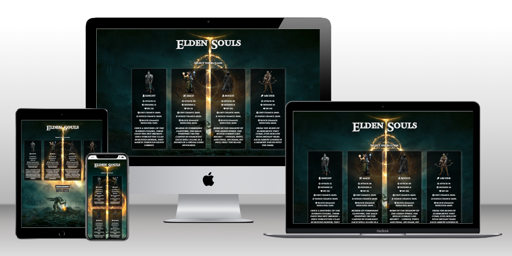

# Elden Souls — A Dark Fantasy Text Adventure Game

**Elden Souls** is a web-based text adventure game inspired by *Dark Souls* and *Elden Ring*. Built with Python and Flask, the game features branching narratives, tactical combat, and a rich, atmospheric world. Players choose from four distinct character classes and embark on a perilous journey through cursed lands.

[Github (repo) link to project](https://github.com/TGOSS1984/text_adventure_game)

[Heroku Link to project](https://elden-souls-text-adventure-app-6406dec306fc.herokuapp.com/)

**Image from my flask web app**



---

## Table of Contents

- [Project Purpose](#project-purpose)
- [Features](#features)
- [File Structure](#file-structure)
- [How to Run Locally](#how-to-run-locally)
- [Story Flowchart](#story-flowchart)
- [Game Logic Overview](#game-logic-overview)
- [Testing & PEP8](#testing--pep8)
- [Deployment](#deployment)
  - [Deploy to Heroku](#deploy-to-heroku)
- [Libraries Used & Rationale](#libraries-used--rationale)
- [Known Issues & Future Enhancements](#known-issues--future-enhancements)
- [Credits](#credits)

---

## Project Purpose

The goal of *Elden Souls* is to provide a lore-rich, interactive text-based adventure that combines storytelling with strategic combat. It showcases Python programming fundamentals, including OOP, data handling, user interaction, and web deployment using Flask. The game is designed to engage users in decision-making, exploration, and tactical battles, simulating the grim fantasy tone of *Elden Ring* and *Dark Souls*. I began brainstorming this idea with the intent of making a fully backend python text adventure which would be run entirely on the console but decided I wanted to integrate some visual flair as well which led me down the route of creating the flask based web application, this was very challenging but ultimately rewarding to learn some of the new concepts.

---

## Features

- 4 unique classes: Knight, Mage, Rogue, Archer — each with lore, stats, and a special item
- Dynamic, branching storylines with hidden paths and multiple endings
- Turn-based battle mechanics with attack, dodge, block, and Estus Flask healing
- Random enemy encounters, can change per playthrough
- Boss fights and lore-driven enemy encounters
- Bonfire system to rest and restore health/Estus
- Save/Load functionality with session storage and JSON backup
- Responsive Flask web interface with gothic-themed styling using html & CSS
- This project was primarily for use of python but as I decided to add some visual style to it using flask I wanted to also add more immersion by adding some themed music whihc be manually controlled by the user 

**Initial Wireframe Design/Concept for story screen**


## Screenshot Examples of game

**Story Screen**


**Battle Screen**


**Death Screen**


---

## File Structure

```
elden_souls/
├── app/
│   ├── __init__.py
│   ├── routes.py
│   ├── models.py
│   ├── combat.py
│   ├── story.py
│   ├── save_load.py
│   ├── templates/
│   │   ├── index.html
│   │   ├── game.html
│   │   ├── battle.html
│   │   └── death.html
│   ├── static/
│   │   ├── css/
│   │   │   └── style.css
│   │   ├── js/
│   │   └── images
├── requirements.txt
├── run.py
├── README.md
├── Procfile
├── .python-version
├── .gitignore
└── storyboard.md
```

---

## How to Run Locally

1. **Clone the repository**

```bash
git clone https://github.com/TGOSS1984/text_adventure_game.git
cd text_adventure_game
```

2. **Set up virtual environment**

```bash
python -m venv venv
source venv/bin/activate  # On Windows: venv\Scripts\activate
```

3. **Install dependencies**

```bash
pip install -r requirements.txt
```

4. **Run the application**

```bash
python run.py
```

5. Visit [http://127.0.0.1:5000](http://127.0.0.1:5000) in your browser.

---

## Story Flowchart

**Overview**

```mermaid
graph LR

    START["🔯 Start: Ashen Ruins"]
    START --> B1["💀 Ashen Knight"]
    B1 --> B2["💀 Mireborn Serpent"]
    B1 --> B3["💀 Grave Warden"]
    B1 --> B4["💀 Ember Tyrant"]

    B2 --> Hub1["â›©ï¸ Chapel of Thorns"]
    B3 --> Hub1
    B4 --> Hub1

    Hub1 --> B5["💀 Lord of Chains"]
    Hub1 --> B6["💀 Pale Drake"]
    Hub1 --> B7["💀 Blacksteel Sentinel"]

    B5 --> Hub2["🌿 Cradle of Thorns"]
    B6 --> Hub2
    B7 --> Hub2

    Hub2 --> B8["💀 Thorn Matriarch"]
    B8 --> B9["💀 Abyss Watcher"]
    B8 --> FINAL["💀 Cindergloom, Lord of Ashes"]

    FINAL --> END1["🌅 Dawn of Flame"]
    FINAL --> END2["🌑 Age of Shadows"]
    FINAL --> END3["â™»ï¸ The Cycle Continues"]
```



**Detailed**

```mermaid
graph TD

START["🔯 Awaken in Ashen Ruins"]
START -->|"Step into the smoldering remains"| R1C1["R1: Ashen Ruins I"]
R1C1 -->|"Search the scorched bones (⚔️)"| R1C2["R1: Ashen Ruins II"]
R1C2 -->|"Wander deeper into the ash"| R1C3["R1: Ashen Ruins III"]

%% --- REGION CHOICES ---
R1C3 -->|"Follow the stench of rot"| R1A["Weeping Marsh"]
R1C3 -->|"Descend into the tomb-mouth"| R1B["Hollow Catacombs"]
R1C3 -->|"Climb the forgotten ledge"| R1C["Obsidian Peaks"]
R1C3 -->|"Kneel before the flame"| BON1["🔥 Bonfire - R1"]

BON1 -->|"Confront the Ashen Knight"| B1["💀 Boss 1: Ashen Knight"]
B1 --> R2C1
B1 --> R3C1
B1 --> R4C1

%% --- REGION 2: Weeping Marsh ---
subgraph Region2["🌑 Weeping Marsh"]
R1A --> R2C1["R2: Marsh I"]
R2C1 --> R2C2["R2: Marsh II (⚔️)"]
R2C2 --> R2C3["R2: Marsh III"]
R2C3 --> BON2["🔥 Bonfire - R2"]
BON2 --> B2["💀 Boss 2: Mireborn Serpent"]
end

B2 --> R3Entry["⛓ Path of Thorns"]
B2 --> R3C1

%% --- REGION 3: Hollow Catacombs ---
subgraph Region3["🪦 Hollow Catacombs"]
R1B --> R3C1["R3: Catacombs I"]
R3C1 --> R3C2["R3: Catacombs II"]
R3C2 --> R3C3["R3: Catacombs III (⚔️)"]
R3C3 --> R3C4["R3: Catacombs IV"]
R3C4 --> BON3["🔥 Bonfire - R3"]
BON3 --> B3["💀 Boss 3: Grave Warden"]
end

B3 --> R3Entry
B3 --> R4C1

%% --- REGION 4: Obsidian Peaks ---
subgraph Region4["⛰️ Obsidian Peaks"]
R1C --> R4C1["R4: Peaks I"]
R4C1 --> R4C2["R4: Peaks II"]
R4C2 --> R4C3["R4: Peaks III (⚔️)"]
R4C3 --> BON4["🔥 Bonfire - R4"]
BON4 --> B4["💀 Boss 4: Ember Tyrant"]
end

B4 --> R3Entry
B4 --> Hub1

%% --- HUB ---
R3Entry --> Hub1["⛩️ Chapel of Thorns"]
Hub1 --> R5C1
Hub1 --> R6C1
Hub1 --> R7C1
Hub1 --> R11C1

%% --- REGION 5: Shattered Keep ---
subgraph Region5["🏰 Shattered Keep"]
R5C1["Keep I"] --> R5C2["Keep II (⚔️)"]
R5C2 --> R5C3["Keep III"]
R5C3 --> BON5["🔥 Bonfire - R5"]
BON5 --> B5["💀 Boss 5: Lord of Chains"]
end
B5 --> Cross1

%% --- REGION 6: Forgotten Valley ---
subgraph Region6["🌫️ Forgotten Valley"]
R6C1["Valley I"] --> R6C2["Valley II"]
R6C2 --> R6C3["Valley III (⚔️)"]
R6C3 --> BON6["🔥 Bonfire - R6"]
BON6 --> B6["💀 Boss 6: Pale Drake"]
end
B6 --> Cross1
B6 --> R7C1

%% --- REGION 7: Iron Bastion ---
subgraph Region7["⚒️ Iron Bastion"]
R7C1["Bastion I"] --> R7C2["Bastion II (⚔️)"]
R7C2 --> R7C3["Bastion III"]
R7C3 --> BON7["🔥 Bonfire - R7"]
BON7 --> B7["💀 Boss 7: Blacksteel Sentinel"]
end
B7 --> Cross1

%% --- REGION 8: Cradle of Thorns ---
subgraph Region8["🌿 Cradle of Thorns"]
Cross1 --> R8C1["Thorns I"]
R8C1 --> R8C2["Thorns II (⚔️)"]
R8C2 --> BON8["🔥 Bonfire - R8"]
BON8 --> B8["💀 Boss 8: Thorn Matriarch"]
end
B8 --> Hub2

%% --- REGION 9: Abyssal Sanctum ---
subgraph Region9["🌌 Abyssal Sanctum"]
Hub2 --> R9C1["Sanctum I"]
R9C1 --> R9C2["Sanctum II (⚔️)"]
R9C2 --> BON9["🔥 Bonfire - R9"]
BON9 --> B9["💀 Boss 9: Abyss Watcher"]
end
B9 --> R10C1

%% --- REGION 10: Forgotten Citadel ---
subgraph Region10["🏯 Forgotten Citadel"]
Hub2 --> R10C1["Citadel I"]
R10C1 --> R10C2["Citadel II (⚔️)"]
R10C2 --> R10C3["Citadel III"]
R10C3 --> BON10["🔥 Bonfire - R10"]
BON10 --> FINAL["💀 Final Boss: Cindergloom, Lord of Ashes"]
end

%% --- ENDINGS ---
FINAL --> END1["🌅 Ending: Dawn of Flame"]
FINAL --> END2["🌑 Ending: Age of Shadows"]
FINAL --> END3["♻️ Ending: The Cycle Continues"]

%% --- OPTIONAL REGIONS (Grouped) ---
subgraph Optional["✨ Optional Regions"]
R11C1["Drowned Village"] --> BON11["🔥 Bonfire - R11"] --> B1
R12C1["Spectral Woods"] --> BON12["🔥 Bonfire - R12"] --> R6C3
R13C1["Tower of Whispers"] --> BON13["🔥 Bonfire - R13"] --> R10C2
R14C1["Molten Depths"] --> BON14["🔥 Bonfire - R14"] --> B4
R15C1["Halls of Echo"] --> BON15["🔥 Bonfire - R15"] --> R5C2
end
```



---
## Game Logic Overview

### Estus Flask System

- Players begin with a limited number of Estus Flasks (default: 3).
- Flasks restore a portion of HP during battle and are stored in the Flask session.
- The `use_estus()` function in `combat.py` checks how many flasks are available and heals the player, updating both HP and the session value.
- Estus count is reset at bonfires and certain story branches like the "rest point".

### Player

- Each class has different perks
- Knight, high defence, high HP, high block absorb, low dodge chance, low attack, low critical hit chance
- Mage, low defence, low hp, medium block absorb, medium dodge chance, high attack, medium critical hit chance
- Rogue, low defence , low hp, medium block absorb, high dodge chance, high attack, medium critical hit chance
- Archer, medium defence, medium hp, high block absorb, medium dodge chance, medium attack, high critical chance

### Battle System Mechanics

- Enemy encounters are triggered by specific story chapters using a `battle` flag in `story.py`.
- Each enemy has distinct stats (HP, attack) and lore.
- Players use one of several actions: `attack`, `block`, `dodge`, or `use estus`.
- Using Block reduces damage by a % depending on class, using dodge has a chance to avoid 100% damage but is based on % chance of sucess for each class, the prompt for enemy upcoming attack was added to encourage use of these mechanics as opposed to just hitting attack.
- Enemy has 3 types of attack, standard attack, massive attack & flurry attack - this is probability based with the flurry attack being most rare & the standard attack being most common
- Animations are added for the flurry attack where the screen pulses Red and for using an Estus flask the sceen turns a green shade with bubbles rising to simulate health regeneration
- Damage calculations are influenced by the player’s class stats (attack/defense) and randomized outcomes via `numpy.random`.
- Dodge and block success/failure use probability thresholds.
- Bosses have higher stats and use adjusted damage scaling.

### Routing & Story Mapping

- Routes are managed in `routes.py` using Flask's routing system.
- Choices made by the player (`POST` requests) determine the next chapter via `choose_path()`.
- Story progression is stored in session, and chapters are fetched dynamically.
- Each chapter includes narrative text, optional choices, flags for battle/rest/bonfire, and hidden conditions.
- HTML templates render logic dynamically from Flask using Jinja2 templating.
- Story chapters are held in seperate.jsons with flags for battle/boss/bonsfire in each
- Story mapping is also kept in a .json file to connect each chapter
- Sotry is loaded using story_engine & Story_loader and they are called in routes.py

---

## Testing & PEP8

### Manual Testing

**Notes**

During development I struggled with Flask session handling — especially when writing unit tests that required active contexts. It took several iterations before I found a clean solution. Many google searches and reddit forums supported with troubleshooting. Some guidance was taken from online resources and AI-assisted tools for structuring markdown and troubleshooting Flask errors, but all content and logic were written and tested by myself.

Learning about flask syntax within hmtl was interesting as I learnt about how to bridge python together with html.

It was interesting to use Heroku for the first time & to troubleshoot new issues which lead me to  learn more about the importance of the project files/requirements.

Initially, I had issues setting the project up in Heroku , when I first linked my project to github I received errors, after troubleshooting the errors were caused by not adding a python version file in my project files. After this fix I found another error – again after troubleshooting I discovered I required a Procfile to be created in my project along with some other requirements in the requirements.txt. After adding these things I  managed to successfully link & run my project in Heroku.

**General Tests**

- Throughout the project regular use of print statements were used to test functions
- Verified form inputs for class selection — ensured radio buttons require a choice
- Validated session-based story progression and choice-based routing
- Tested story branches including edge cases like hidden path detection
- Battles tested for all mechanics (attack, dodge, block, Estus), HP tracking, and boss damage scaling
- Confirmed rest points and bonfire mechanics restore health and Estus Flasks
- Simulated saving/loading: ensured session persists and JSON restores game state
- Enemy image and lore rendering: confirmed fallback behavior works if image missing
- Troubleshot image rendering on mobile devices — updated `background-size: cover;` and height logic
- Resolved bug where lore did not appear despite enemy being generated (fixed session persistence and template binding)
- Investigated print/debug not appearing in console (clarified Flask prints show in terminal where server was started)
- Fixed test failure using `session.get()` outside Flask context by mocking session in unit tests

**Validators**

- HTML tested in html validator (passed, learnt that flask syntax will be flagged as error so ran without)
- CSS validator passed
- JS tested in JSHint without issue

### PEP8 Compliance

## Code Quality & Linting

Code throughout the project has been checked and cleaned to ensure it meets **PEP8 standards**.

### Tools Used

- **`pycodestyle`** was used to identify PEP8 violations:  
  Run `pip install pycodestyle` and  
  `pycodestyle app/ --max-line-length=100`

- **[pep8ci.herokuapp.com](https://pep8ci.herokuapp.com/#)** was used for manual checks.

- **`black`** was installed and used to auto-format the project:  
  Run `pip install black` and `black .`

`black` helped normalize indentation, line length, and overall structure according to modern Python formatting conventions.

### Issues Identified and Resolved

- `E501`: **Line too long**
- `E122`: **Continuation line missing indentation**
- `E302`: **Expected 2 blank lines before top-level function/class**
- `W291`: **Trailing whitespace**
- `W293`: **Blank line contains whitespace**

All modules were successfully cleaned and verified to be **PEP8-compliant**.

---

## Deployment

### Options

**Replit**

- Upload project files to Replit
- Add Flask to `packages`
- Set `run.py` as main file

**Render**

- Push code to GitHub
- Connect GitHub repo to [Render.com](https://render.com)
- Set build command: `pip install -r requirements.txt`
- Set start command: `gunicorn run:app`

### This Project

**VSCode**

- Code was written using VSCode
- Folder structure was a bit more complex than what I have been used to, run.py , Readme, requirements, gitignore all exist in the main folder. All other python files exist within the app folder alogn with templates folder whihc contains the html, the static which contains the CSS/JS & image & sound assests.

**GitHub**

- A GitHub account was created
- A new reposiory was created on GitHub by clicking the 'New' button. It was named and set as public.
- A folder was created in VSCode and initialised as a Git repository
- In VSCode the terminal was used to run commands to link the local project to the GitHub repository
- Throughout the process of builing the website, commits & pushes were staged regularly using terminal commands such as 'git add .' , 'git-commit -m' & 'git push'
- Host the project: Went to my GitHub repository, clicked settings > pages and selected the branch to publish, hit save and then GitHub generated a live link (link at top of readme)

**Deploy to Heroku**

1. **Create **`` in the root directory:

```
web: gunicorn run:app
```

2. **Add **``** to requirements.txt**:

```bash
pip install gunicorn
pip freeze > requirements.txt
```

3. **Commit and push to GitHub**

4. **On Heroku dashboard**:

   - Create a new app
   - Connect your GitHub repo under **Deploy > Deployment method**
   - Enable automatic deploys if desired
   - Click **Deploy Branch**

5. **Open App** once deployed (`https://elden-souls-text-adventure-app-6406dec306fc.herokuapp.com/`)

---

## Libraries Used & Rationale

- **Flask**: Chosen for its simplicity and flexibility in building lightweight web apps
- **NumPy**: Used for random selection and probability-based mechanics in battles
- **FontAwesome**: Adds thematic icons for UI immersion
- **Google Fonts**: Cinzel font reflects the gothic atmosphere of the game
- **font.download**: Mantinia for game title

---

## Known Issues & Future Enhancements

- Add audio feedback during combat (JS-sound integration)
- Add background audio for each differetn area to add to the mood and aid atmosphere
- Mobile UI improvements for full-screen image scaling
- Implement character leveling and item inventory system
- Add unique starting item for different classes
- Evolve the battle system with deeper logic and more variety
- Visual battle animations or transition effects
- Add new imagery for different areas to improve immersion

**Further Notes**

This project has been an exciting challenge and learning opportunity. I approached it with a love for dark fantasy games like Elden Ring and aimed to mirror that tone through mechanics, design, and lore.

The Estus Flask healing system, battle logic using probabilistic chance (e.g., dodge/block), and branching narratives helped push my understanding of OOP, Flask session handling, and modular structure. Early in development, I faced bugs around enemy generation and session persistence, particularly where lore fields were None. I debugged this by confirming object structure and manually storing each field in session.

A particularly tough moment was writing unit tests for Flask routes and session-based features. I encountered the well-known RuntimeError: Working outside of request context, which I resolved by decoupling logic for isolated testing. These real-world bugs helped deepen my understanding of Flask internals.

Every chapter choice, battle flag, or session update was an opportunity to apply core Python logic. Seeing it all tie together in a working game — with visuals, story flow, and user interaction — was rewarding and has sharpened my skills significantly.

I found it helpful to use tools such as black to support with formatting of code but also running the code through the pep8 checker also supported my understanding of best practice with Python.

---

## Credits

- Built by: [Tom Goss](https://github.com/TGOSS1984)
- Icons: FontAwesome
- Fonts: Google Fonts (Cinzel)
- Fonts: Mantinia Font from font.download
- Lore, design, and mechanics inspired by *FromSoftware* games
- Images from Google images
- Pixabay for sound effects

---
